# 实现与运行手册

## 1. 部署拓扑

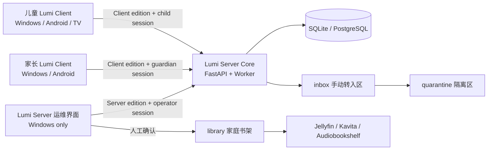

Lumi Server 是家庭 PC/NAS 本身的控制面，不是还要连接的第三台主机；媒体服务是可选的消费面。动画、图书、音频和儿童游戏都可以进入同一目录，但实际播放/阅读由本地资源播放入口或 Jellyfin/Kavita/Audiobookshelf 等专用服务负责。没有安装媒体服务时，平台仍可先完成账号、目录、审批和文件整理。Server 与 Client 是不同安装包，不是同一应用中的角色切换。Client 的“家庭主机地址”只是在告诉 Client 去哪里访问这台 Server：同机为 `127.0.0.1:8000`，局域网为 Server 所在 PC 的固定 IP 和端口。

## 2. 应用、账户与平台边界

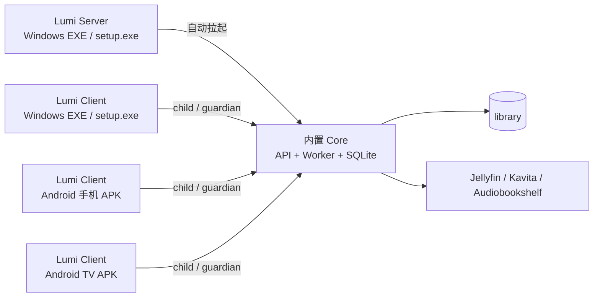

客户端与主机职责必须分离：Client 只封装儿童/家长界面、会话和播放入口；Server 的 Windows 包同时携带运维界面和 Python Core。下载、隔离、入库、定时 Worker、账号数据库和媒体服务只在家庭 PC。后端登录接口会校验 `app_edition`：儿童/家长账号不能登录 Server；运维账号登录 Client 时只签发 `guardian` 有效角色，会话无法访问运维接口，因此修改前端菜单也无法越权。

### 平台支持基线

| 平台 | 正式交付 | 最低支持 | 构建前置 |
| --- | --- | --- | --- |
| Windows Server x64 | 含 Core 的 NSIS `setup.exe`、带 Core 运行库目录的便携包 | Windows 10 1803+（WebView2） | Rust、Python/PyInstaller、NSIS（仅构建机） |
| Windows Client x64 | 独立 EXE、NSIS `setup.exe` | Windows 10 1803+（WebView2） | Rust stable-msvc、VS C++ Build Tools（仅构建机） |
| Android 手机 Client | ARM64/通用 APK、AAB | Android 7.0 / API 24 | Android Studio、SDK、NDK、JDK 17（仅构建机） |
| Android TV Client | 同一 Client APK/AAB，Leanback 类别 | API 24；建议 Android TV 9/API 28+ | 同 Android 手机 |

项目中的 `src-tauri/tauri.conf.json` 已将 Android `minSdkVersion` 固定为 24；当前 Android 构建使用已纳入版本控制的 `native/android-template`，其中已包含局域网 HTTP、Internet 和 `LEANBACK_LAUNCHER` 声明。`scripts/patch-android-tv-manifest.ps1` 仅为旧的 Tauri 生成工程保留，不是当前构建的必需步骤。

构建链会在临时目录准备前端和服务端依赖，并在交给 Tauri、PyInstaller 或 Android 编译器前检查产物完整性。构建机应使用受控依赖缓存、代码签名和构建日志；运行时数据库、媒体文件和签名密钥不进入源码目录。

### 首次建号、注册、审批与登录时序

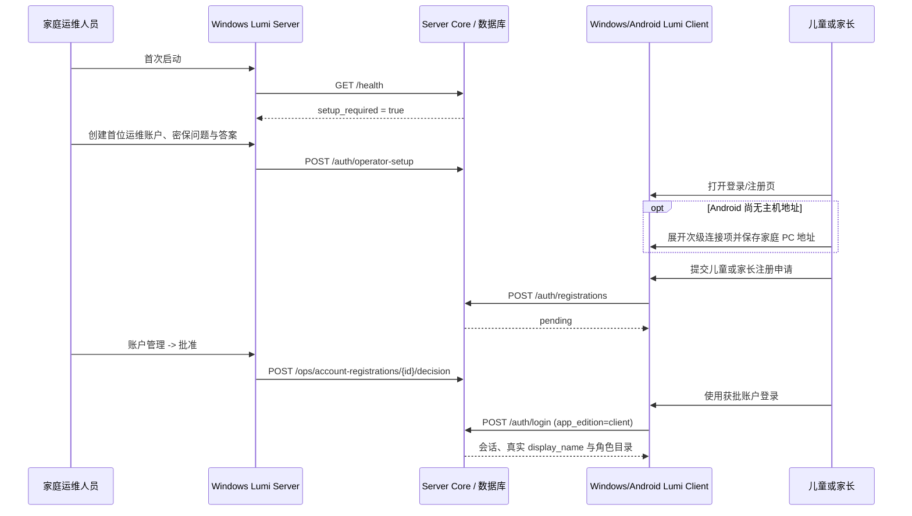

Client 的首屏始终是登录和注册，不再先显示一个独立的连接向导。网络认证必然需要知道 Server 地址，因此 Android 首次连接保留一个默认收起的应急入口；登录后“连接设置”才是常规功能子菜单。儿童端不需要知道下载路径或网盘链接；电视端只显示审核后的播放/阅读内容。运维人员只能在 Windows Server 处理账户、队列和系统设置。

### 运维密码恢复时序

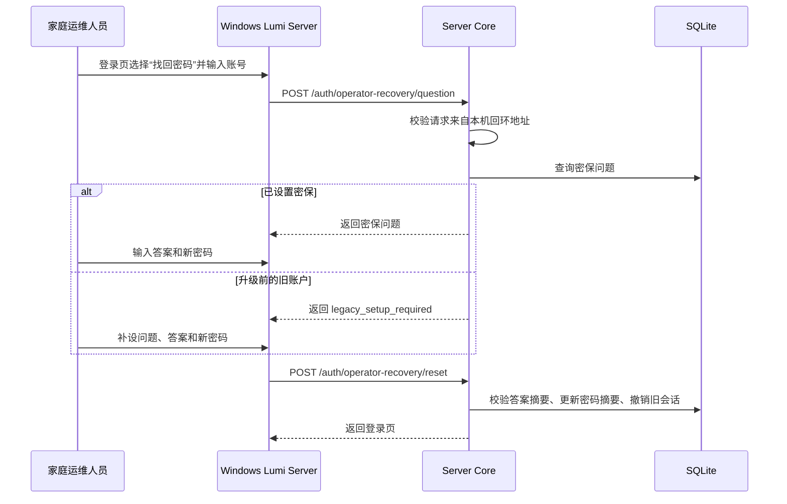

密保管理接口只接受 Server 本机请求，不对 Client 和局域网设备开放。密保问题用于展示，可以明文存储；密码和密保答案分别使用独立随机盐生成 PBKDF2-HMAC-SHA256 摘要，摘要中携带算法与迭代次数版本，未来升级参数时仍能验证旧数据并在成功登录后自动升级。

## 3. 三种角色在两类应用中的操作

### 儿童

1. 登录儿童账号，看到按年龄和兴趣筛选后的动画、绘本、音频、游戏和创作活动。
2. 打开详情，查看语言、时长、主题和家长建议；可以收藏、标记完成或提交观看请求。
3. 儿童永远看不到网盘链接、下载地址、成人目录、管理员队列和账号凭据。

### 家长

1. 查看儿童请求，批准、拒绝或加入稍后观看清单。
2. 提交候选动画、图书、游戏或音频，并填写来源、语言、年龄、版权/使用权说明。
3. 对百度网盘、夸克网盘或社区整理资源，使用官方客户端完成转存，把文件放入 `inbox\cloud`，再在平台中确认“已转入”。
4. 查看本周编排、磁盘空间、失败任务和待人工确认文件。

### 运维管理员（仅 Lumi Server）

1. 验证来源白名单、许可状态和条款确认，决定候选是否可以进入处理队列。
2. 设置夜间时间窗、并发数、磁盘下限和暂停开关，观察 Worker 的校验、隔离、元数据匹配和入库状态。
3. 处理异常文件、重试或暂停任务，确认后才移动到 `library`。
4. 查看审计记录、系统健康状态和备份结果。管理员账号与儿童/家长账号分开。

运维账户可用于登录 Lumi Client，但会话有效角色固定为家长，只显示家长界面且不能调用任何运维账户、下载或审计接口。

## 4. 请求审批时序

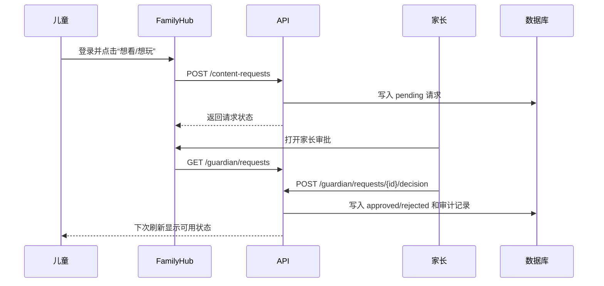

## 5. 社区整理资源时序

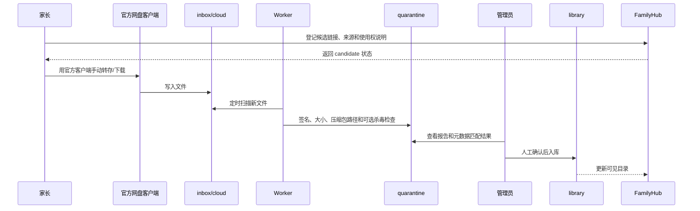

这条链路保留了从 UP 主整理包、百度网盘、夸克网盘等途径获得内容的能力，但不把账号密码交给脚本，也不自动绕过登录、验证码、付费、DRM 或站点保护。系统自动化从“文件已经合法进入本机隔离目录”开始。

## 6. 夜间自动入库时序

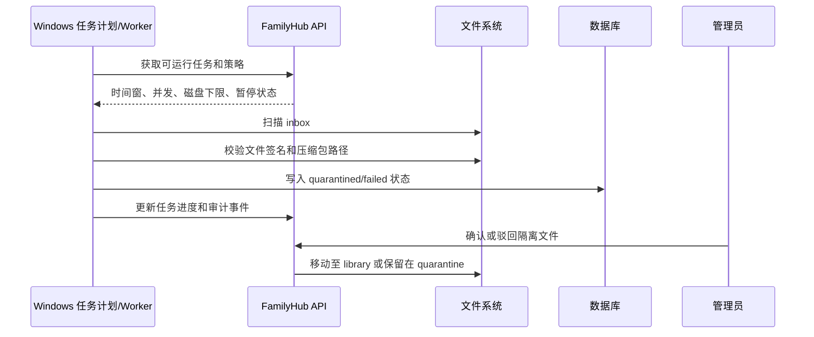

## 7. 关键接口和目录

| 功能 | 接口/位置 | 权限 |
| --- | --- | --- |
| 登录与当前会话 | `/api/v1/auth/login`、`/api/v1/auth/me` | 公开/已登录；登录校验应用版本 |
| 首位运维建号 | `/api/v1/auth/operator-setup` | 仅本机、仅一次 |
| 后续运维建号 | `/api/v1/auth/operators` | 仅 Server 本机 |
| 运维密保查询/重置 | `/api/v1/auth/operator-recovery/question`、`/api/v1/auth/operator-recovery/reset` | 仅 Server 本机；限流；重置后撤销旧会话 |
| 家庭账户申请 | `/api/v1/auth/registrations` | Client 公开提交，初始为 pending |
| 账户审批与停用 | `/api/v1/ops/account-registrations`、`/api/v1/ops/users/{id}/status` | 运维管理员 |
| 儿童目录 | `/api/v1/catalog/today`、`/api/v1/catalog/{id}` | 儿童及以上 |
| 请求审批 | `/api/v1/content-requests`、`/api/v1/guardian/requests` | 儿童/家长 |
| 候选来源 | `/api/v1/community-submissions`、`/api/v1/ops/sources` | 家长/管理员 |
| 任务队列 | `/api/v1/ops/jobs`、`/api/v1/ops/jobs/pause-all` | 管理员 |
| 健康检查 | `/api/v1/health`、`/api/v1/ops/system/status` | 健康检查/管理员 |
| 文件入口 | `inbox`、`quarantine`、`library` | Worker/管理员 |
| Bilibili 下载队列 | `POST /api/v1/ops/downloads/bilibili` | 运维；公开链接、权利确认 |
| Bilibili 任务状态 | `/api/v1/ops/jobs` | 运维 |
| 资源目录设置 | `GET/PUT /api/v1/ops/storage-paths` | 运维；Server 本机路径 |
| 本地资源管理 | `/api/v1/ops/library`、`/scan`、`/import`、`/{id}` | 运维 |
| 在线播放入口 | `POST /api/v1/ops/library/external` | 运维；只保存 HTTPS 入口与元数据 |
| B站订阅同步 | `/api/v1/ops/external-feeds`、`/{id}/sync` | 运维；Worker 定期执行 |
| 本地播放凭证 | `POST /api/v1/catalog/{id}/launch`、`GET /api/v1/media/{id}` | 已登录 Client；短时 ticket |

前端入口在 `src/App.tsx`，API 客户端在 `src/api.ts`，角色状态和缓存逻辑在 `src/store.ts`。后端入口是 `backend/familyhub/main.py`，策略与文件安全分别位于 `policy.py`、`file_safety.py`，后台任务在 `worker.py`。

## 8. PC 阶段运行建议

```text
工作时：Worker 在夜间时间窗处理 inbox，失败文件停留在 quarantine
回家后：家长打开 Web，审批请求并确认隔离文件
孩子使用：只进入 Lumi Client 儿童账户或媒体服务儿童账号
每周：执行 backup.ps1，检查磁盘和 audit 日志
迁移 NAS：停止服务，复制 data/quarantine/library/backups，再改 DataRoot
```

当前代码已经覆盖控制面和本地文件处理的 MVP。实际媒体服务首次安装、家庭账号、硬件转码和内容元数据匹配仍需按家庭设备逐项配置；这些配置不应由儿童账号完成。

## 10. 资源路径、账户安全与 Server/Client 验收

### 10.1 Windows 运行时

安装版 Server 的默认根目录是 `%LOCALAPPDATA%\cn.lumi.familyhub.server\runtime`；便携版使用启动时的运行时配置。目录职责如下：

```text
runtime\
  data\familyhub.db   账户、目录、任务和审计数据
  inbox\cloud\        官方客户端转入或手动复制的候选文件
  quarantine\         下载完成但尚未人工批准的文件
  manifests\          Worker 任务清单
  works\              临时工作区
  cache\              可清理缓存与可选的 B站 Cookie 文件
  library\video\      已审核视频
  library\books\      已审核图书
  library\audio\      已审核音频
  library\images\     封面和图片
```

首位账户接口 `/auth/operator-setup` 只接受本机回环请求且只允许执行一次；后续运维建号和密保恢复接口也只接受 Server 本机请求。密码和密保答案使用不同随机盐和 PBKDF2-HMAC-SHA256 保存不可逆摘要，摘要格式同时记录算法及当前 310,000 次迭代参数；SQLite 中没有明文密码或密保答案。登录会话只保存 SHA-256 令牌摘要，并在独立的 `session_scopes` 表记录本次会话的有效角色。运维账户登录 Client 时有效角色为 `guardian`，登录 Server 时才是 `operator`。

旧版摘要没有携带迭代参数，新版验证器兼容已知历史参数，验证成功后自动升级为带版本格式。升级前没有密保记录的运维账户，可以在 Server 本机完成一次密保初始化和密码重置；完成后恢复必须校验答案。生产部署应使用独立 Windows 账户、NTFS 权限和 BitLocker，并把 `data`、`quarantine`、`library` 纳入备份。Client 不携带数据库，也不会暴露这些路径。

### 10.2 Bilibili 单视频下载

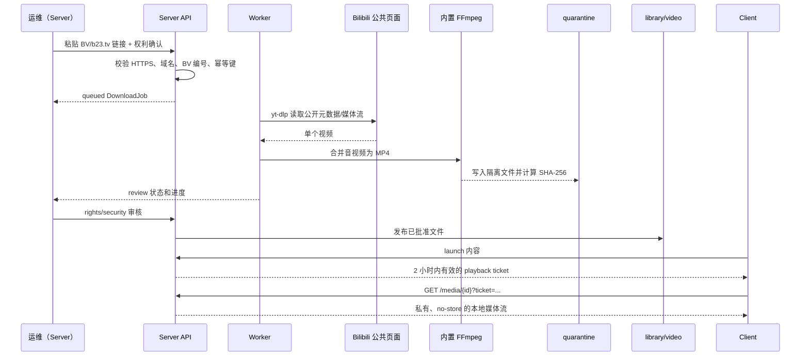

实现限制是有意的：只处理单个公开视频，不读取 Cookie 或账号登录态，不绕过付费、DRM、验证码、地区限制或站点保护，也不把任意命令交给 FFmpeg。网络或站点策略导致失败时，任务进入 `failed`/`blocked`，文件不会自动发布。Bilibili 依赖 `yt-dlp==2026.8.19` 和 `imageio-ffmpeg==0.6.0`，Server Windows 打包时会把这两个运行时及 FFmpeg 一起带入便携目录。

百度网盘、夸克网盘和 UP 主整理包走另一条合规路径：家长用官方客户端完成转存/下载，放入 `inbox\cloud`；Worker 只负责扫描、隔离和生成待审核记录。平台不保存网盘密码、提取码或 Cookie。

### 10.3 本地馆藏、在线播放与自动同步

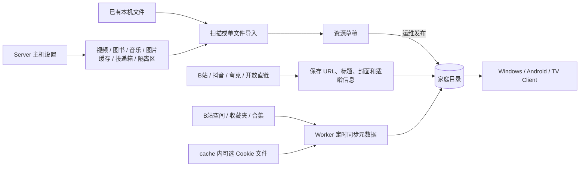

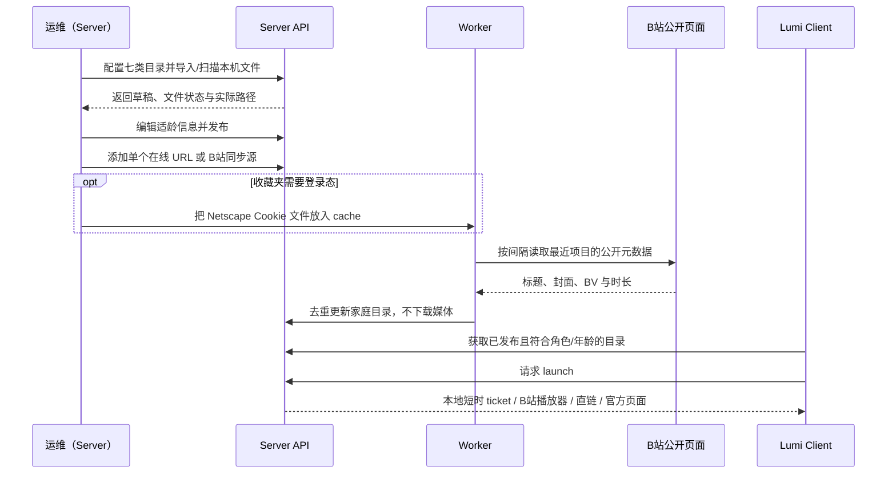

相对 Cookie 路径只相对于当前 `cache` 目录解析，绝对路径也必须位于该目录内且扩展名为 `.txt`。数据库只保存路径；内容不通过 API 返回。B站单条资源即使临时读不到元数据也会保留规范化 BV 入口和占位标题，之后可编辑；收藏夹同步失败会记录错误并在下一周期重试。抖音、夸克等站点可能禁止 iframe、要求登录或启用 DRM，因此 Client 同时保留官方页面入口，不承诺绕过站点限制。

### 10.4 同机验收结果

在独立运行时使用 `Lumi Server 0.4.0` Core 和 Client 0.3.0 验证完整链路：

```text
首次创建带密保的 operator -> 查询密保 -> 重置密码 -> operator 登录 Server
-> Client 注册 guardian -> operator 批准 -> guardian 登录
-> 同一 operator 登录 Client -> 有效角色为 guardian -> 运维接口返回 403
-> inbox/cloud 同步 -> quarantine 扫描 -> operator 审核发布
-> Client 目录 local_available=true
-> launch 获取 local_asset ticket -> GET media 返回 200
-> 1751 字节文件 SHA-256 与原文件一致
```

验证还包括应用边界：child/guardian 使用 `app_edition=server` 被拒绝；operator 的 Client 会话只能使用家长接口。另对已安装数据库的只读备份副本执行了新表迁移、旧运维账户一次性密保初始化以及两类登录验证，正式数据库没有被修改。

## 9. 客户端 OTA 与主机版本协商

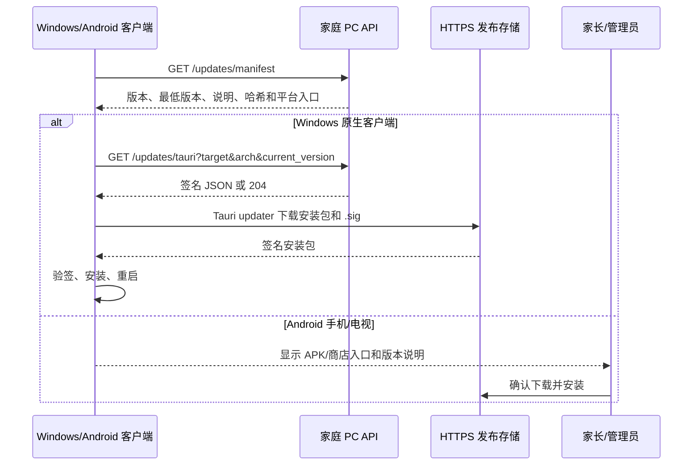

### 更新边界

- `updates/manifest.json` 是公开的只读版本目录，不包含账号、网盘提取码、Cookie、内部路径或媒体信息；清单损坏、超大或下载地址不受信任时，API 返回内置安全默认值。
- Windows/macOS/Linux 只有带 Tauri 签名的产物才进入应用内安装流程。Android/iOS 走家长确认的 APK/商店流程；Android 最低 API 24 保持不变。
- `min_supported_version` 描述客户端兼容下限，`host_api_min_version` 描述家庭 PC 控制面兼容下限。当前 MVP 展示提示，后续可在登录前增加维护页拦截。
- 更新清单必须经 HTTPS、原子替换和哈希校验；发布机私钥、密码和商店凭据不进入 Git、日志或儿童端。
- 回滚采用人工方式：恢复上一份清单并安装保留的旧包；默认不允许降级，避免数据库迁移不兼容。

### 发布检查

```text
1. 同步 tauri.conf.json 版本、manifest.version、host_api_min_version
2. 在受控发布机设置 HTTPS updater endpoint、公钥和签名私钥后执行 `npm run native:release`；它生成不入库的临时发布配置，确认 `.sig` 与安装包一一对应
3. 计算 SHA-256 和大小，填入 updates/manifest.json
4. 在 Windows 测试机验证检查、下载、验签、重启和失败提示
5. 在 Android TV/手机验证人工 APK 或商店入口
6. 备份旧清单、旧安装包和发布审计记录
```
